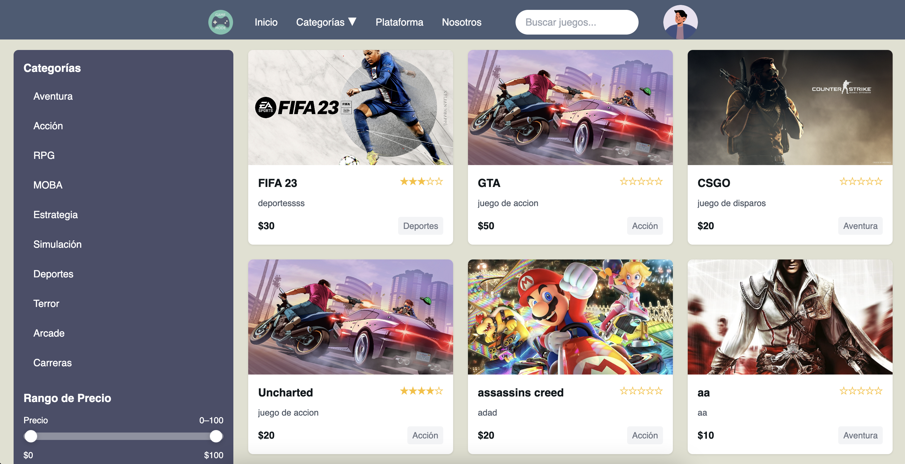
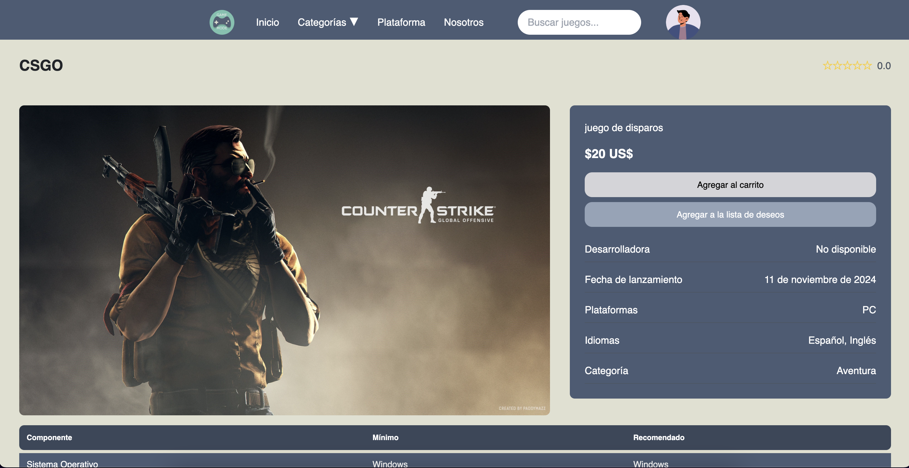
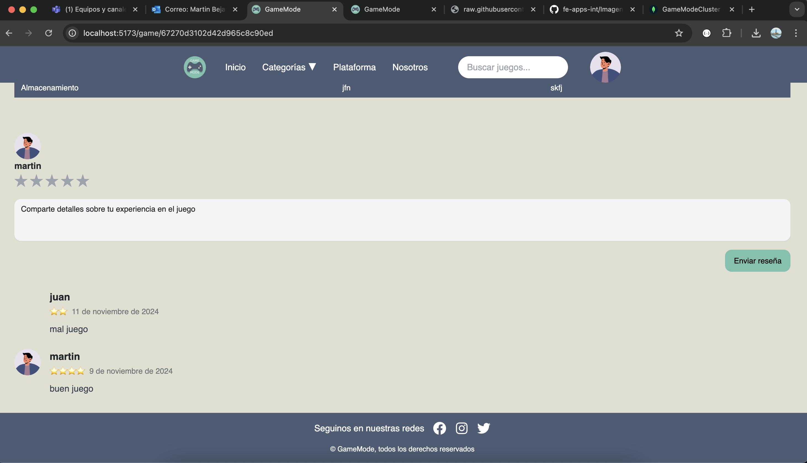
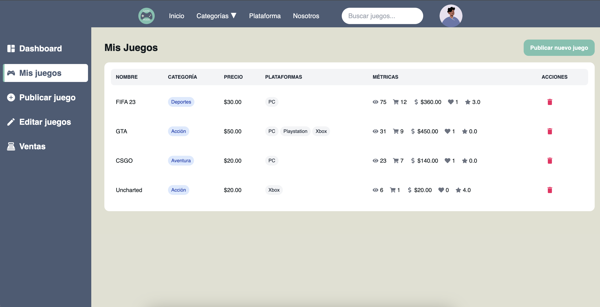
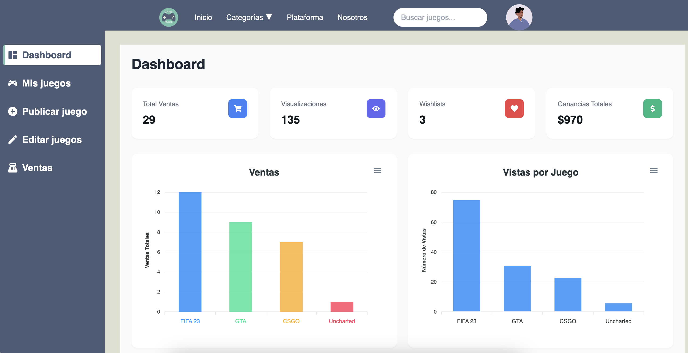
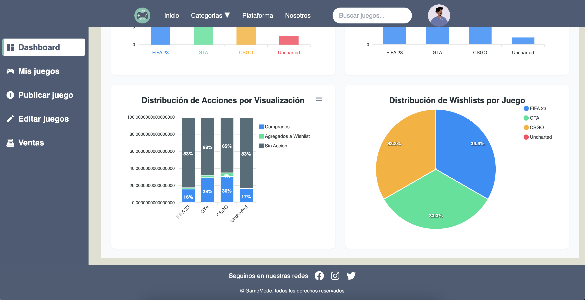

# GameMode 🎮

## Descripción

Este proyecto es la entrega del Trabajo Práctico Obligatorio (TPO) para la materia de **Aplicaciones Interactivas** del segundo semestre de 2024 dictada por Timerman Joaquin, en la carrera de **Ingeniería en Informática** en la **Universidad Argentina de la Empresa (UADE)**. Consiste en un frontend desarrollado en _React.js_ y un backend en **Node.js**, formando una aplicación de marketplace videojuegos completa.
videojuegos completa.

## Integrantes del equipo

- ⁠Martin Bejarano
- ⁠Tomas Dominguez
- Maximiliano Eredjian

GameMode es una plataforma de marketplace de videojuegos que permite a las empresas desarrolladoras publicar y vender sus juegos, mientras que los usuarios pueden descubrir, comprar y gestionar su biblioteca de juegos.

## Características Principales 🚀

### Para Usuarios

### Exploración de juegos con filtros avanzados (categoría, precio, calificación)



### Detalles del juego



### Sistema de reseñas y calificaciones



### Lista de deseos personalizada

- Biblioteca de juegos comprados

### Para Empresas

### Panel de control para gestión de juegos



### Estadísticas detalladas de ventas


### Gestión de publicaciones de juegos

- Seguimiento de métricas (vistas, wishlist, conversión, ganancias)




## Tecnologías Utilizadas 💻

- Frontend: React con TailwindCSS
- Backend: Node.js con Express y TypeScript
- Base de datos: MongoDB con Mongoose
- Autenticación: JWT
- Manejo de archivos: Multer
- Envío de correos: Nodemailer

## Instalación y Configuración 🔧

### Backend

1. Navegar al directorio del backend

```bash
git clone https://github.com/martinnbejarano/GameMode.git
cd gamemode/backend
```

2. Instalar dependencias

```bash
npm install
```

3. Configurar variables de entorno

```bash
cp .env.example .env
```

Editar el archivo `.env` con las siguientes variables:

```env
PORT=3000
DB_URI=mongodb://localhost:27017/gamemode
JWT_SECRET=tu_secret_key
FRONTEND_URL=http://localhost:5173
EMAIL_USER=tu_email@gmail.com
EMAIL_PASSWORD=tu_password_email
```

4. Configurar TypeScript y ESLint

```bash
# Instalar dependencias de desarrollo si no están instaladas
npm install -D typescript @types/node @types/express

# Inicializar configuración de TypeScript
npx tsc --init
```

5. Estructura de directorios del backend

```
backend/
├── src/
│   ├── controllers/
│   ├── middlewares/
│   ├── models/
│   ├── routes/
│   ├── utils/
│   └── index.ts
├── dist/
├── node_modules/
├── .env
├── .gitignore
├── package.json
├── tsconfig.json
└── eslint.config.js
```

6. Iniciar servidor de desarrollo

```bash
npm run dev
```

7. Verificar instalación

El servidor estará corriendo en `http://localhost:3000`. Puedes probar la API con:

### Frontend

1. Navegar al directorio del frontend

```bash
git clone https://github.com/martinnbejarano/GameMode.git
cd gamemode/frontend
```

2. Instalar dependencias

```bash
npm install
```

3. Configurar variables de entorno

Crear un archivo `.env` con las siguientes variables:

```env
REACT_APP_API_URL=http://localhost:3000
```

4. Estructura de directorios del frontend

```
frontend/
├── src/
│   ├── components/
│   ├── pages/
│   ├── utils/
│   └── index.tsx
├── dist/
├── node_modules/
├── .env
├── .gitignore
├── package.json
└── tsconfig.json
```

5. Iniciar servidor de desarrollo

```bash
npm run dev

npm start
```

6. Verificar instalación

El servidor estará corriendo en `http://localhost:5173`. Puedes probar la aplicación con:

## Licencia 📄

Este proyecto está bajo la Licencia GameMode - ver el archivo [LICENSE.md](LICENSE.md) para más detalles.

## Estado del Proyecto 🚦

En desarrollo activo - Versión 1.0.0

---

Hecho con ❤️ por GameMode
